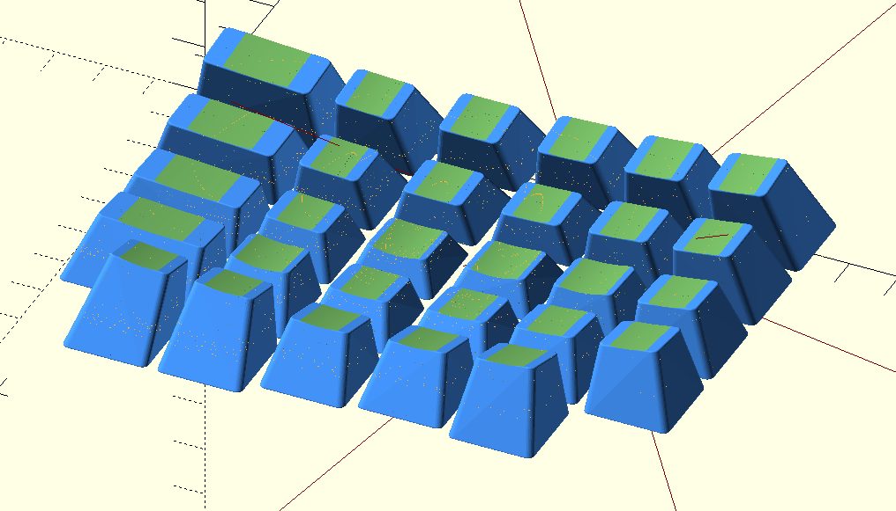

My Ergodox Keycaps
================== 

Is my custom Ergodox EZ Keycaps. The standard Ergodox EZ turns out to be too big for my
asian hand. So, I tried various key layout to try to mitigate for it. This is probably
the latest version. Some of the modification are:

 - Double sculpted.
 - Increase the height of top keys and bottom keys.
 - Move the surface of top keys and bottom keys to make it closer to center.
 - Increase the height of the pinky keys even further. 
 - Make all key smaller. Make the height of the key smaller so it looks a bit rectangular
   instead of a square. 
 - Make pinky key even smaller.
 - A bunch of stuff I dont remember.
 - Resting keys have deeper dish. Which is the key that my finger rest. Usually on the home row, 
   but my home row for my pinky is one key lower, so the key with deeper dish there is one key lower.

Note: The `stem_inner_slop` setting it low to minimize wiggle. But it maybe a bit hard to fit.

I dont print other keys because I cant reach them.

